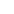

This is out final year project.
created by Jay Suthar , Keval Patel , Jainil Prajapti , Kanav Shukla.
https://kevalp24.github.io/Motor-Rework/


  <!-- <footer class="footer">
    <div class="footer-top section">
      <div class="container">
        <div class="footer-brand">
          <a href="#" class="logo">
            
          </a>
          <p class="footer-text"> Motor Rework system is a new software solution designed to transform the automotive service industry </p>
          <ul class="social-list">
            <li>
              <a href="https://www.linkedin.com/in/jay-suthar-26a488256/" class="social-link">
                
              </a>
            </li>
            <li>
              <a href="https://www.instagram.com/jaysuthar1804/" class="social-link">
                
              </a>
            </li>
            <li>
              <a href="https://x.com/jaysuthar1804" class="social-link">
                
              </a>
            </li>
          </ul>
        </div>
        <ul class="footer-list">
          <li>
            <p class="h3">Team Members</p>
          </li>
          <li>
            <span class="span">Jay Suthar</span>
          </li>
          <li>
            <span class="span">Keval Patel</span>
          </li>
          <li>
            <span class="span">Jainil Prajapati</span>
          </li>
          <li>
            <span class="span">Kanav Shukla</span>
          </li>
        </ul>
        <ul class="footer-list">
          <li>
            <p class="h3">Contact Info</p>
          </li>
          <li>
            <a href="tel:+9172279828661" class="footer-link">
              <span class="material-symbols-rounded">call</span>
              <span class="span">+91 7227982866</span>
            </a>
          </li>
          <li>
            <a href="mailto:jaysuthar1804@gmail.com" class="footer-link">
              <span class="material-symbols-rounded">mail</span>
              <span class="span">jaysuthar1804@gmail.com</span>
            </a>
          </li>
          <li>
            <address class="footer-link address">
              <span class="material-symbols-rounded">location_on</span>
              <span class="span">Parul Univervisty, Vadodara, Gujarat, India</span>
            </address>
          </li>
        </ul>
      </div>
      
    </div>
    <div class="footer-bottom">
      <div class="container">
        <p class="copyright">Copyright 2024, Motor Rework. All Rights Reserved.</p>
      </div>
    </div>
  </footer> -->
<!-- # Essential Stuff

## Html import links

Google font

``` html
<link rel="preconnect" href="https://fonts.googleapis.com">
<link rel="preconnect" href="https://fonts.gstatic.com" crossorigin>
<link href="https://fonts.googleapis.com/css2?family=Chakra+Petch:wght@400;600;700&family=Mulish&display=swap"
  rel="stylesheet">
```

Material icon font

``` html
<link rel="stylesheet"
  href="https://fonts.googleapis.com/css2?family=Material+Symbols+Rounded:opsz,wght,FILL,GRAD@40,600,0,0" />
```

---

## Colors

``` css
--international-orange-engineering: hsl(1, 91%, 37%);
--cadet-blue-creyola: hsl(222, 14%, 69%);
--oxford-blue-1: hsl(222, 47%, 15%);
--oxford-blue-2: hsl(222, 44%, 14%);
--oxford-blue-3: hsl(222, 50%, 11%);
--sonic-silver: hsl(0, 0%, 44%);
--space-cadet: hsl(222, 44%, 18%);
--pastel-pink: hsl(1, 53%, 75%);
--eerie-black: hsl(0, 0%, 15%);
--light-gray: hsl(0, 0%, 80%);
--white: hsl(0, 0%, 100%);
```

## Typography

``` css
--ff-chakra-petch: 'Chakra Petch', sans-serif;
--ff-mulish: 'Mulish', sans-serif;

--fs-1: 3.5rem;
--fs-2: 3rem;
--fs-3: 2.4rem;
--fs-4: 1.8rem;
--fs-5: 1.4rem;
--fs-6: 1.2rem;

--fw-400: 400;
--fw-600: 600;
--fw-700: 700;
```

## Spacing

``` css
--section-padding: 60px;
```

## Shadow

``` css
--shadow: 0px 0px 100px 0px hsl(216, 9%, 90%);
```

## Border Radius

``` css
--radius-pill: 100px;
--radius-circle: 50%;
```

## Transition

``` css
--transition: 0.25s ease;
--cubic-out: cubic-bezier(0.05, 0.83, 0.52, 0.97);
```
 -->